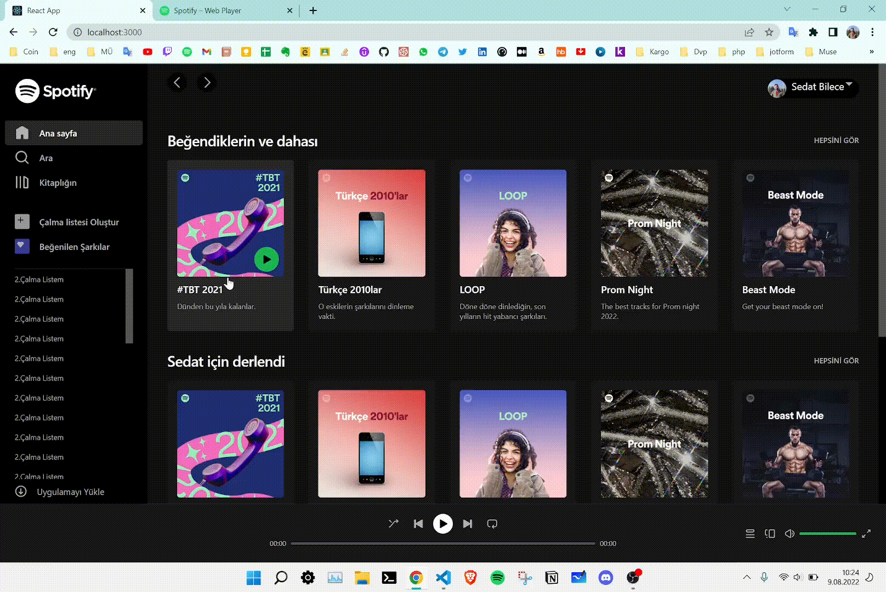
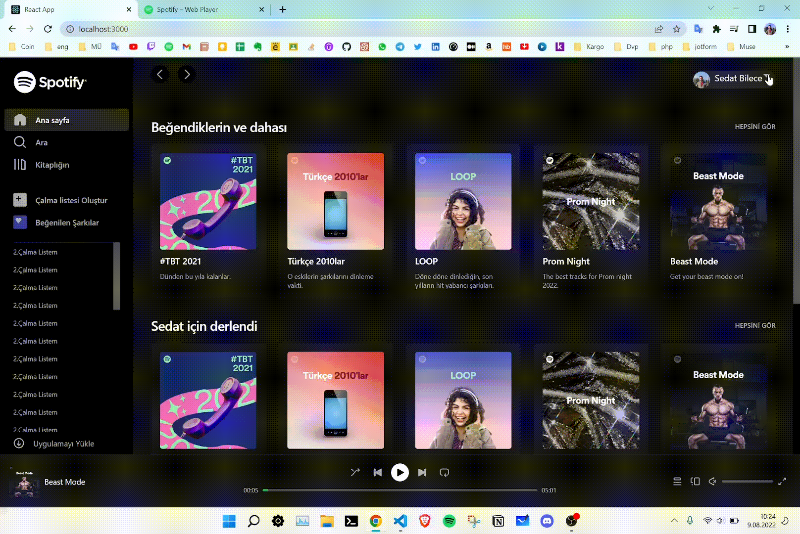

# React Spotify Clone

In this project  has been made active working `volume control`, `menu control`  with keyboard, `slider` , `routing`  structure and while all this try to  make like spotify ui with `tailwind`

## Used Pacgakes
<ul>  
    <li>
           Tailwind : UI Library
    </li>
    <li>
           Redux-toolkit : State management
    </li>
    <li>
           React-range : Audio slider
    </li>
    <li>
           React-use : Audio management
    </li>
    <li>
           React-Router : Content Pagination
    </li>
    <li>
           Headlessui : Keyboard control
    </li>
</ul>
    
##### Here is the video

[Video's Link](https://drive.google.com/file/d/16OpUrzV6XMgCO_-K37UzF5mnImwfdmmw/view?usp=sharing)    

## Player (gif)
We can play on the duration of the song in the player, switch to different songs, control the volume

##  Sidebar (gif)
Content is loaded with the router structure in the sidebar.

 
   

 ##  Menu (gif)
Controls can be made with the keyboard in the menu

 
 

   
